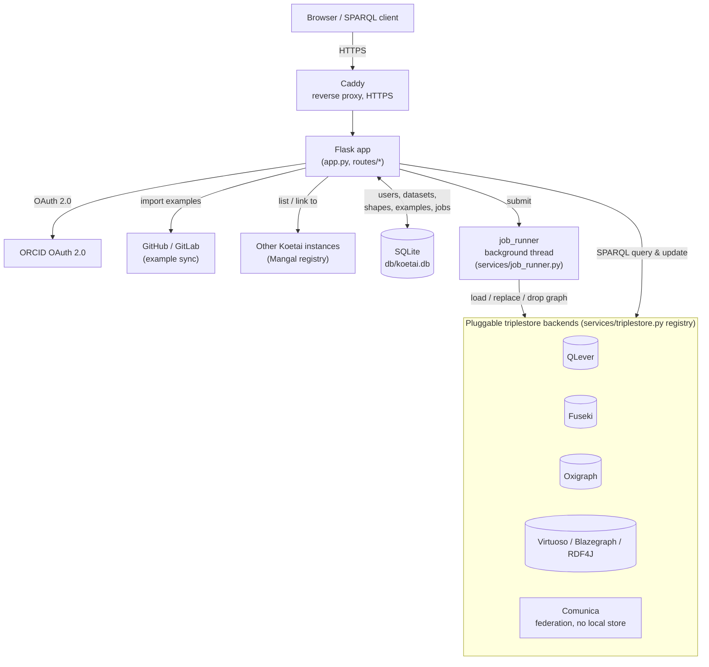
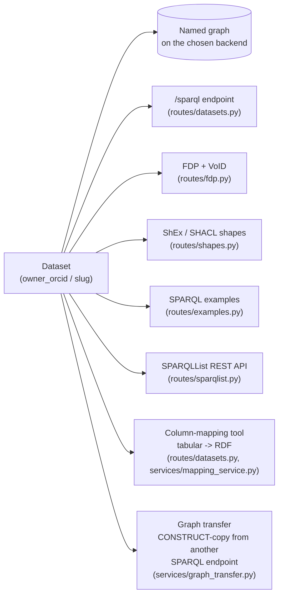
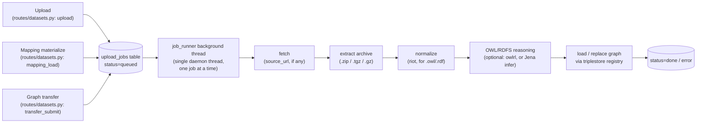
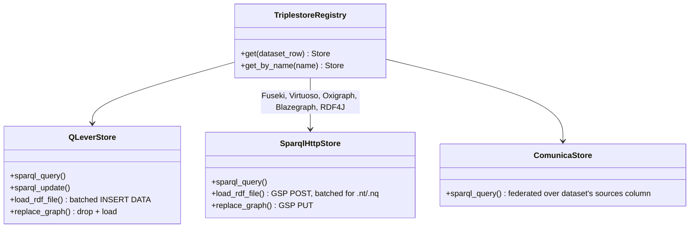

# Koetai Platform — Architecture

Koetai is a multi-tenant Flask app: one process serves every user's dataset,
each dataset picks its own triplestore backend, and anything slow (RDF
loading, reasoning, remote fetches) runs as an async background job rather
than on the request thread. This page diagrams the shape of that, grounded
in the actual modules (paths in parentheses throughout).

## System overview

Caddy terminates TLS and proxies to the Flask app on :3002
(`koetai-platform.service`). The app itself never talks to a triplestore
directly — every read and write goes through the registry in
`services/triplestore.py`, which resolves a dataset's `platform` DB column
to a backend client. SQLite (no ORM, `services/db.py`) holds everything
*about* datasets — never the RDF itself.

## Dataset anatomy

Each row in `datasets` is the hub for everything a user sees under
`/u/<owner_orcid>/<slug>/...`:

A dataset's `platform` column (`qlever`, `fuseki`, `oxigraph`, `virtuoso`,
`blazegraph`, `rdf4j`, or `comunica`) is fixed per dataset, not per file —
everything loaded into it lands in the same backend and the same named graph
(`graph_base + "/data"`).

## Async job pipeline

RDF never gets parsed, reasoned over, or loaded on the request thread — a
multi-gigabyte file would outlive any HTTP timeout. Three entry points
(direct upload, mapping materialize, graph transfer) all funnel into the same
job queue and the same background thread:

A page polls `/upload/status/<job_id>` for progress. Steps a given job
doesn't need (no `source_url`, not an archive, not `.owl`/`.rdf`, reasoning
not requested) are skipped, not run as no-ops.

## Triplestore backend abstraction

Every backend implements the same small interface, so `job_runner` and the
SPARQL-proxy route never know which store they're talking to:

QLever has no Graph Store Protocol, so `QLeverStore` speaks SPARQL Update
directly (`services/qlever.py`); every other backend implements GSP and
shares one `SparqlHttpStore` class (`services/sparql_http.py`), configured
per backend with its own base URL, paths, and auth. Both loaders batch
line-based (`.nt`/`.nq`) files so peak memory and request size stay bounded
regardless of file size — the one thing that must never scale with the file
being loaded, on a backend serving every tenant from one shared instance.

## Key files

| Concern | File |
|---|---|
| Route entry points | `routes/*.py` |
| Dataset CRUD, upload, SPARQL proxy | `routes/datasets.py` |
| Triplestore registry | `services/triplestore.py` |
| Backend clients | `services/qlever.py`, `services/sparql_http.py`, `services/comunica.py` |
| Background job queue | `services/job_runner.py` |
| Tabular-to-RDF mapping | `services/mapping_service.py` |
| Cross-instance graph copy | `services/graph_transfer.py` |
| FAIR Data Point / VoID | `routes/fdp.py`, `services/void_service.py` |
| Shape inference/validation | `services/shexer_service.py`, `services/rudof_service.py`, `services/rdfconfig_service.py` |
| Sister-instance registry | `services/mangal.py`, `mangal.yaml` |
| DB schema | `db/schema.sql` |
